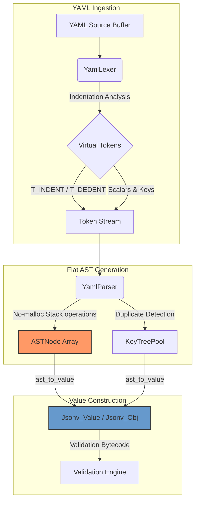

# Specification & Implementation Plan: YAML Parsing

This document defines the specification and implementation plan for adding YAML parsing support to the `jsonv` library. The primary design goal is to **share the same underlying data structures** (`ASTNode`, `Jsonv_Value`, `Jsonv_Obj`, `Jsonv_Arr`, `Jsonv_Shape`) between the JSON and YAML systems, enabling seamless interoperability with the existing schema compiler, validation engine, and memory managers.

---

## 1. Architectural Overview

To support YAML without adding performance overhead or duplicating runtime logic, we will build a modular YAML compiler pipeline consisting of:
1. **YAML Lexer (`yaml_lexer.h`/`yaml_lexer.c`)**: A zero-copy token scanner that handles block indentation, flow structures, and string parsing. It translates indentation transitions (increases/decreases) into virtual structural tokens (`T_INDENT`, `T_DEDENT`), decoupling layout analysis from parsing.
2. **YAML Parser (`yaml_parser.h`/`yaml_parser.c`)**: A stack-based, non-recursive parser that processes the token stream and builds the flat, array-based `ASTNode` representation. It uses identical node linking and duplicate key sorting (`KeyTreePool`) as the JSON parser.
3. **AST to Value Converter**: Utilizes the existing `ast_to_value` function from `parser.c` to instantiate shapes and runtime value objects directly from the generated AST.



---

## 2. YAML Feature Scope

The parser will support a clean subset of YAML 1.2 appropriate for config and structured data ingestion:
*   **Block Mappings**: Indentation-based key-value pairs (`key: value`).
*   **Block Sequences**: Indentation-based lists using `- ` bullets.
*   **Mixed Nesting**: Sequences containing mappings, and mappings containing sequences.
*   **Flow Style**: JSON-like inline mappings (`{k: v}`) and sequences (`[v1, v2]`) (integrated inside the YAML parser).
*   **Scalars**: 
    *   Unquoted strings (zero-copy string views referencing the original buffer).
    *   Single-quoted (`'...'`) and double-quoted (`"..."`) strings.
    *   Numbers (integers and floating-point).
    *   Booleans (`true`/`false`, `yes`/`no`, `on`/`off`).
    *   Nulls (`null`, `~`).
*   **Comments**: Ignores comments (`# comment`) both on newlines and inline.

---

## 3. Lexer Design (`yaml_lexer.h` / `yaml_lexer.c`)

### 3.1 Indentation State Machine

The YAML lexer tracks indentation levels using an internal, fixed-size stack of integers (avoiding dynamic allocation).

```c
#define MAX_YAML_DEPTH 64

typedef struct YamlLexer {
  const unsigned char *source;
  size_t source_len;
  size_t current_pos;
  
  // Indentation stack
  int indent_stack[MAX_YAML_DEPTH];
  int indent_top;
  
  // Virtual token queueing
  int pending_dedents;
  bool emit_indent;
  
  // Positional tracking
  int line;
  int col;
  bool is_line_start;
} YamlLexer;
```

### 3.2 Indentation Transitions
At the start of every line, the lexer scans leading whitespace (spaces only; tabs are disallowed or trigger `T_ERROR`):
*   Let `L` be the measured indentation level.
*   Let `T` be the current top of the indentation stack.
*   **Case 1: `L > T`**
    *   Push `L` to `indent_stack`.
    *   Emit a virtual `T_INDENT` token.
*   **Case 2: `L < T`**
    *   While `L < indent_stack[indent_top]`, pop the stack and queue a virtual `T_DEDENT` token.
    *   If `L != indent_stack[indent_top]`, emit `T_ERROR` (alignment error).
*   **Case 3: `L == T`**
    *   No structural changes. Emit standard tokens.

### 3.3 Zero-Copy String Views
Unquoted strings in YAML are delimited by syntax markers (like `:`, `,`, `]`, `}`, or newlines). The lexer scans until these boundaries and returns a `Token` referencing the source buffer directly:

```c
typedef enum {
  // Shared tokens + YAML specific
  T_YAML_INDENT = 20,
  T_YAML_DEDENT = 21,
  T_YAML_BULLET = 22,
  T_YAML_KEY = 23,
  // ...
} YamlTokenType;
```

---

## 4. Parser Design (`yaml_parser.h` / `yaml_parser.c`)

The YAML parser constructs the identical flat `ASTNode` array layout used by the JSON parser.

### 4.1 AST Node Schema
```c
typedef struct ASTNode {
  Token token;          // String views, numbers, booleans, or null
  int parent;           // Parent index in stack (-1 if root)
  ASTNodeType type;     // AST_OBJECT, AST_ARRAY, AST_LEAF, etc.
  int first_child;      // Head of the intrusive child list
  int next_sibling;     // Sibling pointer index
  int key_tree_root;    // Alphabetical binary search tree root index
} ASTNode;
```

### 4.2 Stack-Based Transition Logic
The parser runs in a non-recursive loop using three stacks allocated from the transient arena:
1.  **Controls Stack**: Tracks expected grammar items (rules or terminals).
2.  **Scopes Stack**: Intrusive layout tracking `[ParentIndex, TailIndex, ItemCount]`.
3.  **Indent Stack**: Aligned with the lexer to handle block scopes.

```c
typedef enum {
  RULE_YAML_DOC = 300,
  RULE_YAML_BLOCK_NODE,
  RULE_YAML_BLOCK_MAP,
  RULE_YAML_BLOCK_SEQ,
  RULE_YAML_MAP_PAIR,
  RULE_YAML_SEQ_ITEM
} YamlRuleType;
```

When expanding `RULE_YAML_BLOCK_MAP`:
*   Create an `AST_OBJECT` node.
*   Link to parent scope.
*   Push object context onto `scopes`.
*   Parse key-value pairs recursively until a virtual `T_DEDENT` or `T_EOF` is encountered.

---

## 5. Memory Management & Strict Laws

In compliance with the project's **AGENTS.md** directives:

1.  **No Standard Allocations**: All structures (lexer, parser stacks, AST storage) are allocated from the custom `Jsonv_Arena` chained allocator passed to the parser. No calls to `malloc` or `free` will be introduced.
2.  **Zero-Copy Parsing**: Keys and string values are held as pointers into the original input buffer. String allocations are only performed when converting the AST to runtime shapes via `arena_alloc_str` inside the arena.
3.  **Graceful OOM Handling**: All memory requests check for arena exhaustion. If an allocation fails, the parser will abort and return a specific validation failure rather than crashing.
4.  **Function folding**: All newly added functions will strictly utilize folding comments (`/*#region*/` and `/*#endregion*/`).

---

## 6. Implementation Plan & Phased Roadmap

### Phase 1: Core YamlLexer Development
*   Implement `src/parser/yaml_lexer.h` and `src/parser/yaml_lexer.c`.
*   Build the indentation stack tracking mechanism.
*   Implement zero-copy scans for unquoted scalars, single/double quotes, and comments.
*   Create `tests/yaml_lexer.test.c` to test indentation transitions, scalar types, and edge cases.

### Phase 2: YamlParser Development
*   Implement `src/parser/yaml_parser.h` and `src/parser/yaml_parser.c`.
*   Build grammar transition rules (`RULE_YAML_BLOCK_MAP`, `RULE_YAML_BLOCK_SEQ`, etc.).
*   Integrate duplicate key detection using the existing `set_t` structure.
*   Integrate alphabetical sorted key insertion via `KeyTreePool` to preserve shape-sharing guarantees.
*   Create `tests/yaml_parser.test.c` validating AST layouts for simple/nested mappings and sequences.

### Phase 3: Runtime Integration & API Extension
*   Integrate YAML AST generation with the existing `ast_to_value` logic.
*   Expose parsing functions in `src/include/ctx.h`:
    ```c
    JSONV_API bool jsonv_ctx_parse_yaml_data(
        Jsonv_Context *ctx,
        const unsigned char *data_yaml
    );
    ```
*   Update `src/ctx/ctx.c` to implement context data parsing using the new YAML pipeline.

### Phase 4: Verification and Quality Assurance
*   Verify memory safety by running the test suite under Valgrind/ASan to verify there are no memory leaks or out-of-bounds reads.
*   Add integration tests verifying schema validation of parsed YAML documents against compiled JSON schemas.
